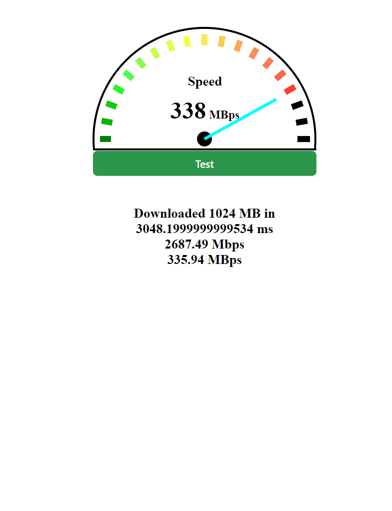
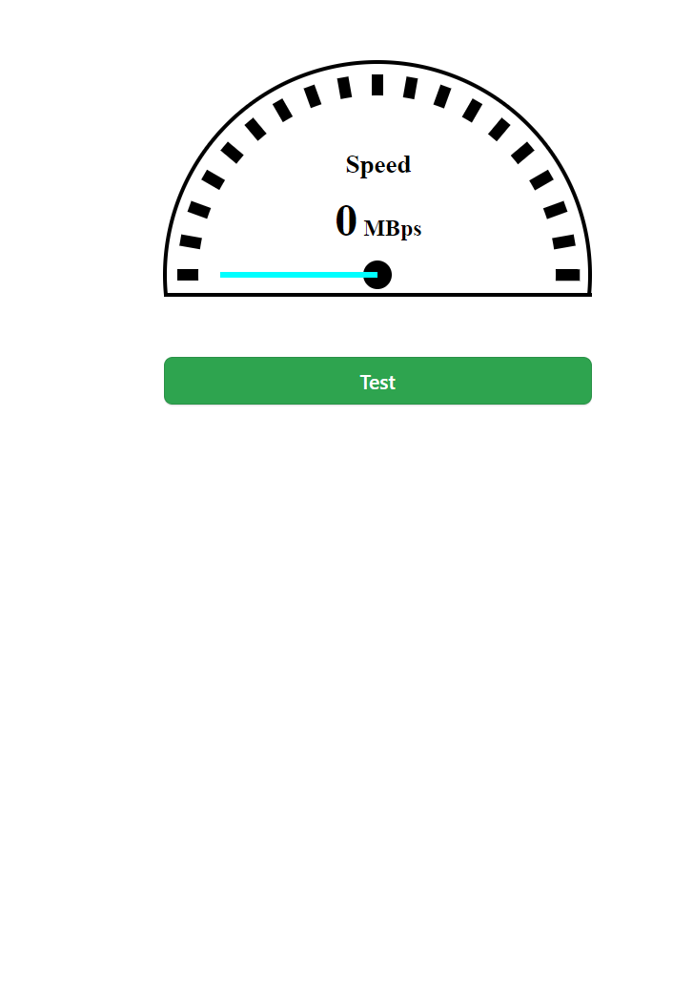

# Speed Tester

A local network internet speed tester built using Python Flask and ReactJS.

## Overview

This project allows users to measure their internet speed within a local network environment. It is developed using Python Flask for the backend and ReactJS for the frontend.

## Features

- Generates and sends data chunks to simulate download speed.
- Provides accurate speed measurement for local network connections.
- Easy-to-use interface for conducting speed tests.

## Technologies Used

- Python Flask: Backend server framework for handling requests and generating data.
- ReactJS: Frontend framework for building the user interface.
- NumPy: Python library used for generating zero data chunks.

## Installation

1. Clone this repository.
2. Install dependencies using `pip install -r requirements.txt`.
3. Navigate to the `client` directory and install frontend dependencies using `npm i`.
4. Run the application using `python app.py` for the backend and `npm run dev -- --host 0.0.0.0 --port 5173` for the frontend.

## How to Use

1. Go to http://localhost:5173/
2. Click on the "Start Test" button to begin the speed test.
3. View the speed test results on the dashboard.

## Contributing

Contributions are welcome! Feel free to fork the repository, make changes, and submit a pull request to improve the project.

## image

  
  

